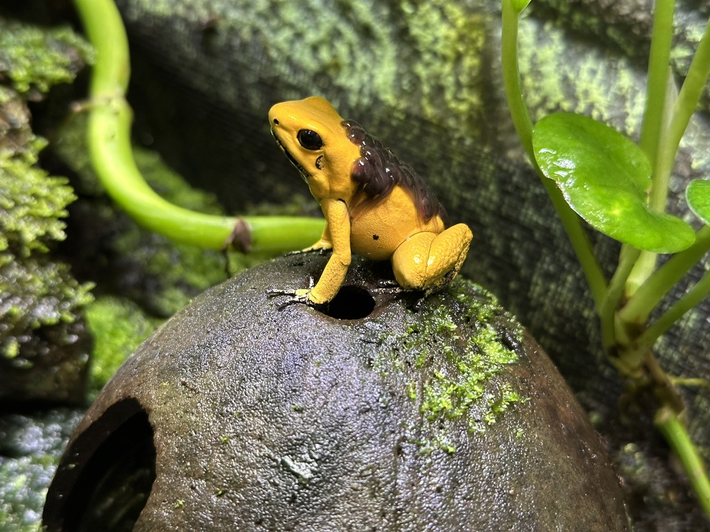
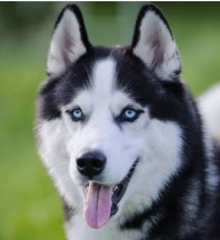
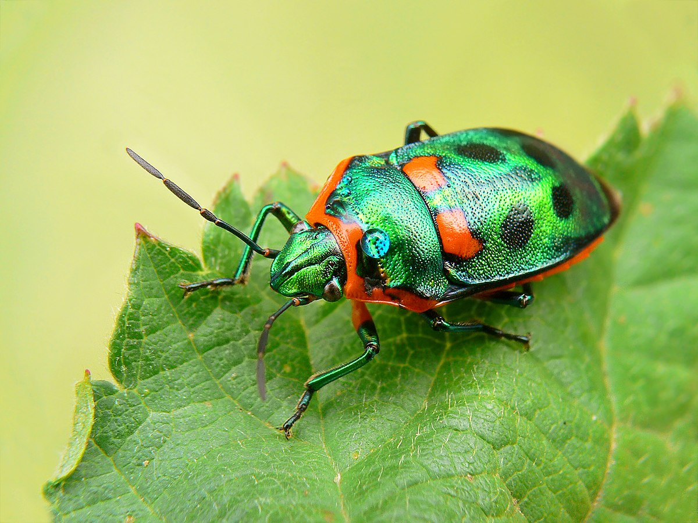
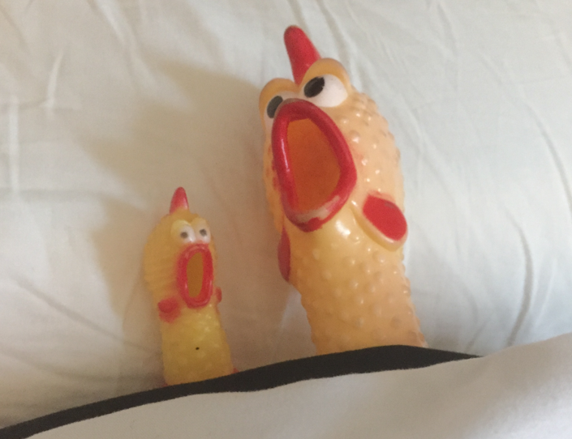

# Pretty Bugs 

🐛✨🐛✨🐛✨🐛✨🐛✨🐛✨🐛✨🐛✨🐛✨🐛✨🐛✨🐛✨🐛✨🐛✨🐛✨🐛✨

This is a collection of students' projects, showcasing their work in progress (bugs, artifacts, and anything that is scrappy and unfinished). 

## Laura
Here is what I think happens when you turn the light on while acquiring an image:


## Froggo


## Husky



## Ce
Learning to code:


## Zhi's bug



## Tom
Here is a pretty bug


## Jonathan
AAAAAAAA



```{toctree}
:maxdepth: 2
:caption: Sections

```
